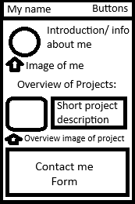

# Feature: Home Page 

## Goal 

implement `index.html` 

## Design 

 

## Work

- Simple black and white design.
- Locked Top bar with buttons that linked to different pages.
- Flexbox to display multiple objects next to one another. (ex: image and text)
- Alt text for accesibility.
- Divs for creating and organising objects.
- Hovering over a button makes it a dark gray to show that its interactable.
- Different font to showcase capabilities.

## Deliverables

- "Done" will look like a basic, simple markdown page that showcases various skills and projects that I have done.
- CV-esque oriented design.
- Is displayed well across all devices.